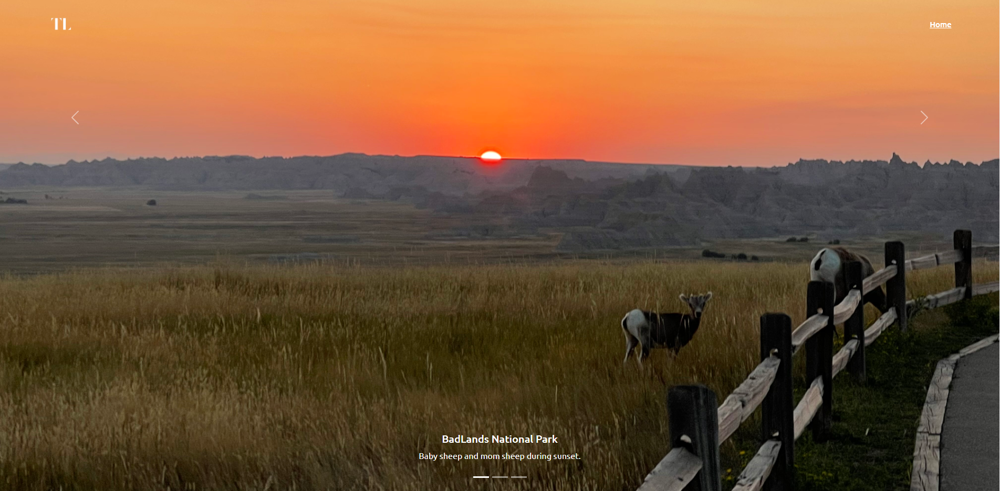

# Project 1: Personal Homepage 

## Project Objective 

An home page shows my skills, courses, projects, hobbies.

## Class Link 

https://johnguerra.co/classes/webDevelopment_fall_2022/

## Screenshot 

1. main page

2. photo page

 
## Tech requirements

1. Web browers (eg. Chrome)

## How to use

follow the link: https://timlu7.github.io/index.html

## Author

Tianyu Lu
https://timlu7.github.io/index.html

##  Video Demonstration

## License
[MIT](https://choosealicense.com/licenses/mit/)
